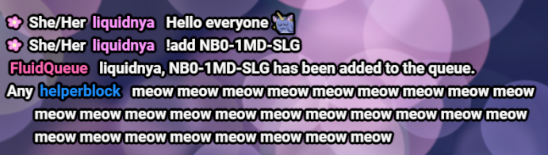

# pronouns-chat

Custom HTML/CSS for Streamlabs Chat Box or StreamElements Custom Widget.



## Features

- Replaces emoji with [jdecked/twemoji](https://github.com/jdecked/twemoji).
- Adds pronouns next to the names of users if they have them setup through <https://pronouns.alejo.io/>.
- Changes the badges and emotes to use the best quality.
- Makes name colors readable.
- Adds support for emote effects by FFZ.
- Clears chat messages appropriatly whenever someone is timed out, banned or if their message is deleted and also clears the whole chat when the `/clear` command is used.
- Mitigates a bug in Streamlabs Chat Box where the message is HTML encoded whenever `<` and `>` are contained within the message and emotes where placed incorrectly. Note that this mitigation will not display ffz, bttv, and 7tv emotes, but at least the message is readable again.

## How do I use this?

### StreamElements

To use this in StreamElements click this link to add this custom chat widget as an overlay to your overlays: <https://streamelements.com/dashboard/overlays/share/64b019dc1e43e1975d208c5e>

To customize the widget click on the chat widget and then open `Settings` on the left.

There is a feature to replace or hide emotes as well, for details see the [CHANGELOG.md](CHANGELOG.md) and click on the widget and then `Settings` -> `OPEN EDITOR` -> `JS`.

### Streamlabs

1. Go to your `Streamlabs Dashboard` then to `All Widgets` and then to the [`Chat Box`](https://streamlabs.com/dashboard#/chatbox).
2. Set `Enable Custom HTML/CSS` to `Enabled`.
3. Click on the `HTML` tab and put the contents of the file [`streamlabs/custom.html`](streamlabs/custom.html) into the textbox overriding what was in there before.
4. Click on the `CSS` tab and put the contents of the file [`streamlabs/custom.css`](streamlabs/custom.css) into the textbox overriding what was in there before.
5. Click on the `JS` tab and put the contents of the file [`streamlabs/custom.js`](streamlabs/custom.js) into the textbox overriding what was in there before.
6. Press the `Save Settings` button at the end of the page.

**Streamlabs Customizations:**

To adjust the padding on the left side of messages with more than one line do the following:

1. Go to your `Streamlabs Dashboard` then to `All Widgets` and then to the [`Chat Box`](https://streamlabs.com/dashboard#/chatbox).
2. Click on the `Add Custom Fields` button on the bottom right corner.
3. Click on the `Edit Custom Fields` button on the bottom right corner.
4. Replace the contents of the textbox with the contents of the file [`streamlabs/custom.json`](streamlabs/custom.json).
5. Press the `Update` button on the bottom right corner.
6. Adjust the padding by using the slider and save the settings.

To use all features except displaying the pronouns of users do the following:

1. Go to your `Streamlabs Dashboard` then to `All Widgets` and then to the [`Chat Box`](https://streamlabs.com/dashboard#/chatbox).
2. Click on the `JS` tab.
3. Replace `"showPronouns": true,` with `"showPronouns": false,` and save the settings.

To hide known global frog emotes from bttv and 7tv do the following:

1. Go to your `Streamlabs Dashboard` then to `All Widgets` and then to the [`Chat Box`](https://streamlabs.com/dashboard#/chatbox).
2. Click on the `JS` tab.
3. Replace `"showFrogEmotes": true` with `"showFrogEmotes": false` and save the settings.

There is a feature to replace or hide emotes as well, for details see the [CHANGELOG.md](CHANGELOG.md).

## Building from source

To build the overlay from source you need the following requirements:

- Make sure `node` and `npm` is installed for example by installing [Node.js](https://nodejs.org/en).

Install dependencies:

```sh
npm install --include=dev
```

To clean the `dist` folder first use:

```sh
npm run clean
```

To build the sources after cleaning the `dist` folder run:

```sh
npm run build
```

This will compile the files into the `dist` folder.

To format the files use:

```sh
npm run fmt
```

To check the sources for compilation or linter errors use:

```sh
npm run check
```

## LICENSE

The following files have their license information within the file itself:

- `src/features/ffz.ts`
- `src/features/ffz.css`
- `streamlabs/custom.css`
- `streamlabs/custom.js`
- `streamelements/custom.css`
- `streamelements/custom.js`

All other fies are distributed under the MIT license.

See [COPYING](COPYING) for details.

## Disclaimer

This project is not affiliated with or endorsed by Streamlabs, StreamElements, jdecked/twemoji, pronouns.alejo.io, nor FrankerFaceZ.
