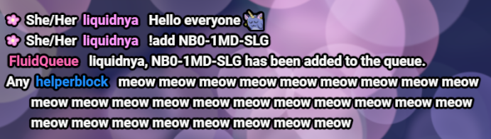

# pronouns-chat

Custom on-screen chat for Streamlabs Chat Box or StreamElements Custom Widget.

## Features

- Replaces emoji with [@twemoji/api](https://github.com/jdecked/twemoji) with Unicode `17.0` support.
- Adds pronouns next to the names of users
  - if they have them setup through <https://pr.alejo.io/>
  - or if they have them setup through <https://pronoundb.org/>.
- Changes the badges and emotes to use the best quality.
- Makes name colors readable.
- Adds support for emote effects by FFZ.
- Clears chat messages appropriatly whenever someone is timed out, banned or if their message is deleted and also clears the whole chat when the `/clear` command is used.
- Mitigates a bug in Streamlabs Chat Box where the message is HTML encoded whenever `<` and `>` are contained within the message and emotes where placed incorrectly. Note that this mitigation will not display ffz, bttv, and 7tv emotes, but at least the message is readable again.
- Does not display `/s` for the display name of chatters who have spaces in their display name.

## Supported browser versions

The following browsers are supported:

- Chrome version `107`
- Edge version `107`
- Firefox version `104`
- Safari version `16`

Since OBS Studio is using chromium as a browser source engine, the minimum OBS Studio version is:

- OBS Studio version `31.0.0` (released 2024-12-07)

Please make sure to use supported versions.

## How do I use this?

### StreamElements

Please see [streamelements/README.md](streamelements#readme) for instructions on how to install this custom widget on a StreamElements overlay.

### Streamlabs

Please see [streamlabs/README.md](streamlabs#readme) for instructions on how to install this in the Streamlabs chat box widget.

### Standalone Version

There are plans to create a standalone version for this widget that does not require StreamElements nor Streamlabs.
[liquidnya](https://github.com/liquidnya) has made a proof of concept version that already works, but it is not ready to be used by others yet.

This version will have a single HTML file that needs to be downloaded and then just added as a browser source into your OBS.

Note: [liquidnya](https://github.com/liquidnya) has made [a standalone clips-player](https://github.com/liquidnya/clips-player) that can be used to play twitch clips in an OBS browser source and the standalone version of pronouns-chat will be based on that.

## Roadmap

- Standalone version
  - [ ] Re-implement or find the source code of the standalone version
  - [ ] Write documentation on how to use the standalone version
  - [ ] Release the standalone version
  - [ ] Create a video explaining how to use it
- Planned features for the standalone version
  - [ ] Opening the HTML file in your browser instead of adding it as a browser source will
    - [ ] show documentation on how to add it
    - [ ] have a UI where all the settings can be set instead of having to change code or query parameters
    - [ ] have an option to export an HTML file that contains the settings
  - [ ] Improve handling of twitch access tokens in localStorage
- Other plans
  - [ ] Merge features from [nyancrimew's fork](https://github.com/nyancrimew/woke-chat)
    - [space out emotes a bit](https://github.com/nyancrimew/woke-chat/commit/e58ad18f3d3afa3ccdd7a7947d750cdf80fb85a4) with settings to enable/disable this
    - [add colon after user meta](https://github.com/nyancrimew/woke-chat/commit/c1e3375ced54e4f6f563ea6ae6207b2f92441f0e) with settings to enable/disable this
    - [add border around pronouns](https://github.com/nyancrimew/woke-chat/commit/6e65f4728b8e6145374391475b7d19416479174d) with settings to enable/disable this
    - [fix styling for users without pronouns](https://github.com/nyancrimew/woke-chat/commit/f34fab0930bdf04a0f5bb509687cd38a171b4194)
  - [ ] Update the screenshot at the top of this file

Whenever the standalone version releases the Streamlabs and Streamelements versions might no longer receive feature updates, but they will be maintained for a bit.

## Contributing

You do not need to build this widget from source to use it (see above).
However, here is the documentation on how to build it from source such that it is easier for you to make changes to the source code in the [contribution guidelines](./CONTRIBUTING.md#your-first-code-contribution).

## Related Projects

> Please message [liquidnya](https://github.com/liquidnya) if you know about more projects that support pronouns for an on-screen chat overlay.

- [slime2](https://github.com/zaytri/slime2) - A widget independant from Streamlabs/StreamElements. However this widget is source available, but **not open source**; as of 2026-03-29, see [Terms of Use](https://github.com/zaytri/slime2?tab=readme-ov-file#terms-of-use) of slime2.
- [woke-chat](https://github.com/nyancrimew/woke-chat) - A fork of pronouns-chat, maintained by [maia arson crimew](https://github.com/nyancrimew). The style of how chat messages are displayed is different: style fixes, borders around pronouns, and a colon between name and message.

This project (pronouns-chat) has been created, because of the lack of very simple (no custom decorations) chat overlays that support pronouns and are open source.

## LICENSE

The following files have their license information within the file itself:

- `src/features/ffz.ts`
- `src/features/ffz.css`
- `streamlabs/custom.css`
- `streamlabs/custom.js`
- `streamelements/custom.css`
- `streamelements/custom.js`

All other fies are distributed under the MIT license.

See [COPYING](COPYING) for details.
